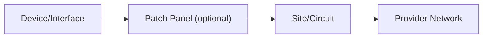
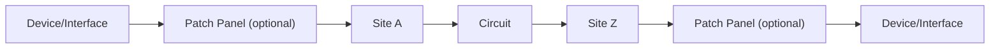

**Standard Circuit**


**Point-to-Point Circuit**


**Meet Me Circuit**
```mermaid
graph LR
A[Device/Interface] --> B["Patch Panel A"]
B --> C["Patch Panel Z"]
C --> D[Site/Circuit]
D --> E[Provider Network]